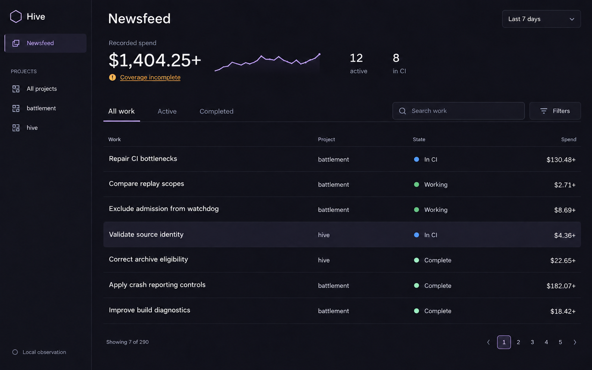
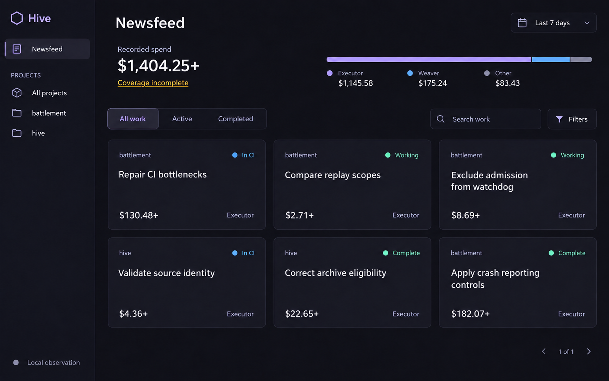
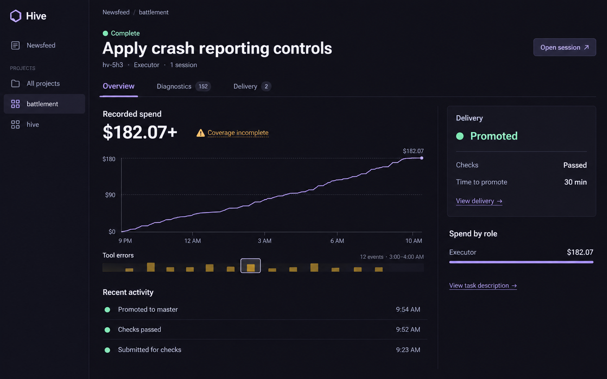

# Dashboard design mockups

Three final visual concepts generated with built-in imagegen on September 25,
2026, preserving Hive's dark violet aesthetic while reducing visible copy and
organizing work, cost, and delivery information.

These are design references, not implemented screens or live application data.
Titles, values, counts, and timelines are illustrative; interactions and
responsive behavior have not been tested.

## Work list — recommended direction

Aligned task titles, projects, states, and costs make a large collection of work
easier to scan, with descriptions and provenance reserved for task details.

## Refined cards — alternative direction

A quieter version of the existing card layout, keeping only the project, state,
task title, cost, and role visible on each card.

## Task detail

A compact spending chart, grouped error events, and a delivery summary put the
overview in one screen, with diagnostics available through a separate tab.

